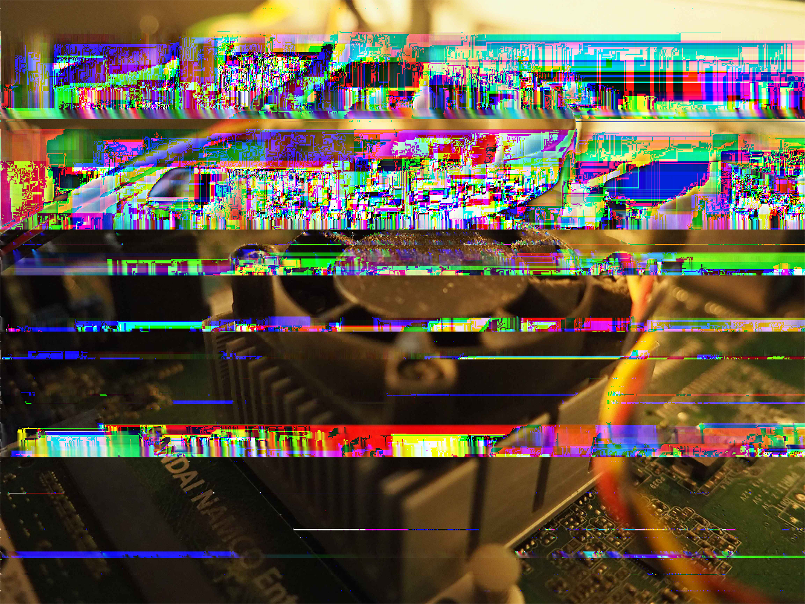
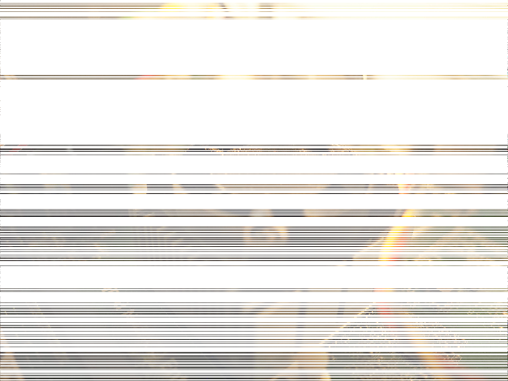
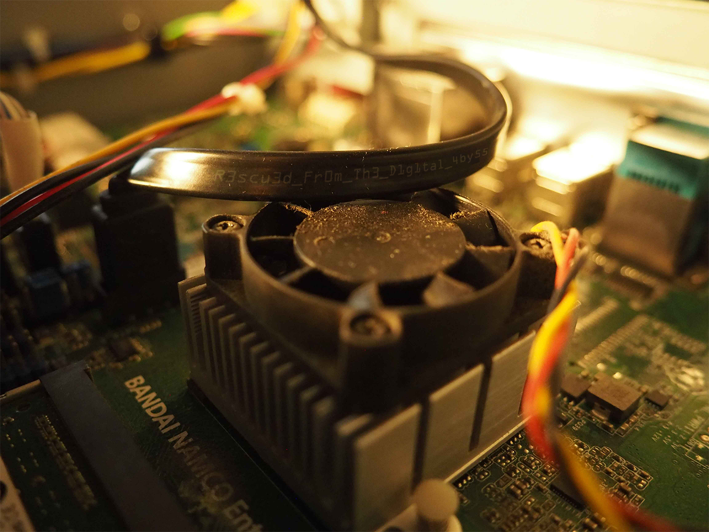

**Corrupted - 50 Points**

Summary: Mess with the PNG scanline filters



This is a beautiful puzzle. It seems like traditional steganography, but it's not. I won't go into details of the various stego tools you can try. There's tons available online and a variety

The first question to ask is, how can you create glitch effects like this? In particular, in PNG?

Step 1. Google `PNG glitch effects`

Result: https://ucnv.github.io/pnglitch/

This brings our attention to PNG scanline filters. But what exactly are they?

To summarise:

PNGs utilise lossless compression. However, the first step of encoding a PNG image is not compressing it. The first step is to make the image *more compressible*. That's what the goal of these scanline filters are. A scanline is just a horizontal row of pixel data. There are 5 kinds of filters:

0. None (no filtering)
1. Sub
2. Up
3. Average
4. Paeth

You don't really need to know exactly how they work, but if you're interested I encourage you to read the [PNG Specification](https://www.w3.org/TR/2003/REC-PNG-20031110).

Each scanline has one and only one filter. These filters are chosen to optimise the lossless compression. Note that filters are reversible (which is what makes it lossless).

There are lots of ways to view the scanlines in an image, e.g. using the pngcheck CLI tool:
```
pngcheck -vv challenge.png
```

There's nothing immediately wrong about the filters used, but lets take a step back and revisit the PNG Glitch article.

It mentions a Ruby library called [PNGlitch](https://github.com/ucnv/pnglitch), so let's play about with it.

This lets us incorrectly replace all the scanline filters with 0 (None).

```ruby
require "pnglitch"

PNGlitch.open("challenge.png") do |png|
  png.each_scanline do |line|
    line.graft 0
  end
  png.save "challenge-zero-filter.png"
end
```



See how the glitch effect has now completely vanished? Although unfortunately so has most of the image...

This is a good sign though! It indicates that it's something to do with the *existing* filters. Perhaps filters have been applied incorrectly?

I got quite lucky with this puzzle, as my first attempt was the right solution. Remember how each number 0-4 maps to a specific scanline? What's happening is that two of them have been swapped. Instead of `1` representing Sub and `2` representing Up, the opposite is now the case. Instead of getting a lucky guess, you can bruteforce all the possible combinations. Hint: there aren't that many.

```ruby
require "pnglitch"

PNGlitch.open("challenge.png") do |png|
  png.each_scanline do |line|
    if line.filter_type == 2
      line.graft 1
    end
  end
  png.save "challenge-restored.png"
end
```

This is a pretty elegant solution - only 9 lines of Ruby! My original solution involved using a [PNG decoder I found online](https://github.com/yohhoy/picopdec) and altering how the scanline filters were applied.

Edit: Credit to `velvetpulse` for pointing out that Filter 1 is missing from the original PNG. This means that the solve script can be simplified by 2 lines (compare `solve.rb` and `solve-improved.rb`).



It's a little hard to read but you can see that the flag is `R3scu3d_Fr0m_Th3_D1g1tal_4by55`
